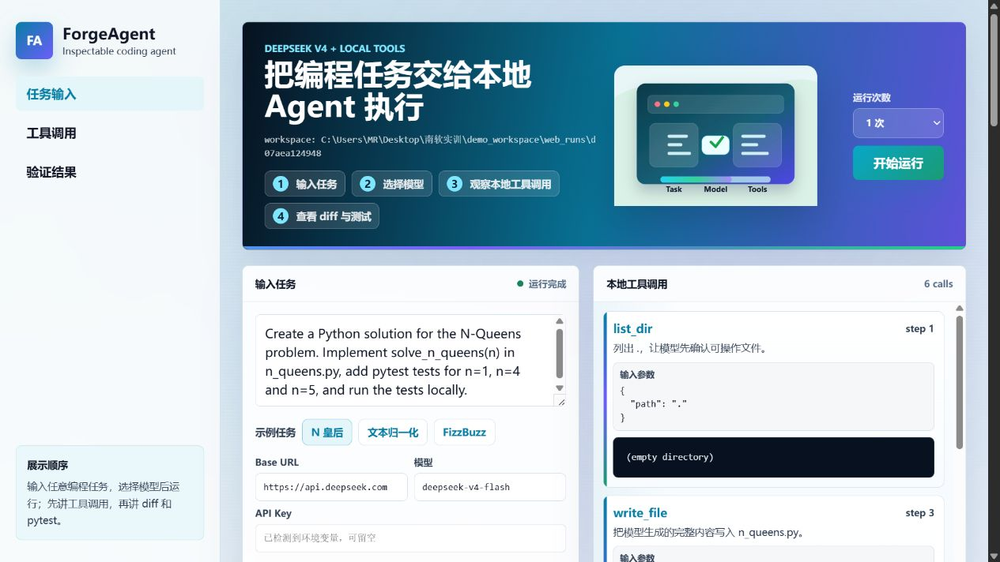

# ForgeAgent

ForgeAgent is an inspectable coding agent built from Python's standard library. It uses an OpenAI-compatible chat model to plan one action at a time, execute local tools inside a selected workspace, feed observations back into the conversation, and stop only after a final response, an unrecoverable model error, or a step limit.

The project intentionally does not use LangChain, LlamaIndex, OpenAI Agents SDK, Claude Agent SDK, AutoGen, CrewAI, hosted code execution, or hosted file tools. The important mechanisms are implemented in this repository: message history, context compaction, tool schemas, workspace path checks, subprocess execution, JSON action parsing, error recovery, and termination policy.

## Quick start

```powershell
python -m venv .venv
.\.venv\Scripts\Activate.ps1
python -m pip install -r requirements.txt
python -m pytest -q
python scripts/run_deepseek_demo.py
python scripts/demo_server.py
```

For a real model, copy `.env.example` to a local `.env` or set the variables in the shell, then run:

```powershell
$env:OPENAI_API_KEY = "..."
python -m coding_agent "Add tests and improve the error handling" --root .
```

The runtime reads `OPENAI_API_KEY`, `OPENAI_BASE_URL`, `OPENAI_MODEL`, and `OPENAI_TIMEOUT`. Secrets are never read from a tracked file. The CLI asks before running shell commands; pass `--yes` only in a trusted disposable workspace. Destructive commands such as recursive forced deletion, `git reset --hard`, and disk shutdown/format commands are blocked before approval.

For the DeepSeek V4 path, set `DEEPSEEK_API_KEY` and run `python scripts/run_deepseek_demo.py`. The default model is `deepseek-v4-flash`; the web demo accepts the key from the password field at runtime or from `DEEPSEEK_API_KEY`. The value is not written to the repository, screenshot assets, or generated submission files.

## Architecture

`Agent` owns the loop and transcript. `ToolRegistry` owns explicit schemas and dispatch. File tools are workspace-scoped and shell output is bounded and time-limited. The model is an adapter behind a tiny protocol, so production runs use DeepSeek through an OpenAI-compatible API while tests can use a deterministic fake model without network access.

The project also includes a local memory layer inspired by the design of `dsh-memoir`: completed tool-using runs are distilled into `.agent/memory.json`, rendered to `.agent/PROJECT_MEMORY.md`, retrieved with lexical BM25 over Chinese text, English words, and code identifiers, and injected into future runs as bounded Hot Memory. The memory feature is implemented in Python in this repository and does not require the DSH plugin runtime.

## Repository Layout

```text
coding_agent/          agent loop, model adapter, parser, tools, memory
examples/              disposable demo workspace and deterministic test model
scripts/               CLI demos, web demo server, assignment audit, packaging
tests/                 pytest suite for parser, tools, model client, memory, loop
web_demo/              browser demo for DeepSeek V4 and local tool inspection
```

Read the code in this order when reviewing the implementation: `coding_agent/agent.py`, `coding_agent/parser.py`, `coding_agent/tools/registry.py`, `coding_agent/tools/filesystem.py`, `coding_agent/tools/shell.py`, `coding_agent/llm.py`, then `coding_agent/memory.py`.

## Demo Output

`python scripts/run_deepseek_demo.py` resets a small workspace, lets DeepSeek V4 inspect and edit files through ForgeAgent tools, runs pytest locally, then prints the generated project memory. A successful run shows:

```text
[MODEL 1] {"kind":"tool","tool":"list_dir","arguments":{"path":"."}}
[TOOL 5] run_command: exit_code=0
..                                                                       [100%]
2 passed in 0.01s

RESULT: completed; steps=6
Implemented `fizzbuzz(n)` ... Verified by running `python -m pytest test_fizzbuzz.py -q`.

PROJECT MEMORY
## Work Log
- Agent run completed - Completed run using tools: list_dir, read_file, edit_file, run_command.
```

For recording and visual inspection, run `python scripts/demo_server.py` and open `http://127.0.0.1:8787`. The web page is API-only: it sends the task to DeepSeek V4, creates an isolated scratch workspace, and puts the important evidence on screen: local tool calls, JSON arguments, generated code, real diff, pytest output, workspace path, run history, and project memory. The example buttons only fill the prompt; the agent can also start from a blank workspace and create files for a new task such as N-Queens.



The demo page can be run more than once. Each browser run receives an isolated workspace under `demo_workspace/web_runs/`, so repeated checks do not overwrite each other.

The command-line demo still includes reproducible FizzBuzz and text-normalization tasks for regression checks. To try DeepSeek V4 Pro, set `DEEPSEEK_MODEL=deepseek-v4-pro` or edit the model field on the web page.

## Assignment Audit

Run:

```powershell
python scripts/audit_assignment.py
```

The audit checks `README.txt` length and repository URL, forbidden agent framework imports/dependencies, obvious committed API keys, DeepSeek V4 defaults, required core files, and the pytest suite.

## Development

Run `python -m pytest -q` after changes. Keep commits small and explanatory so the public repository shows the development process required by the assignment.

`THIRD_PARTY_NOTICES.md` records the memory-layer reference project and licensing note.
